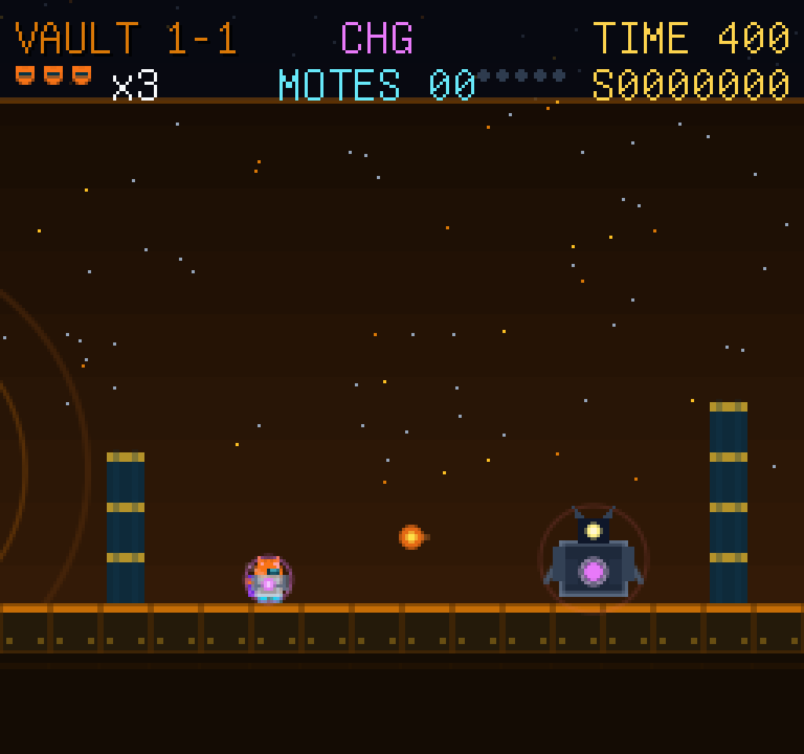

# Super Kilix: The Driftway

Super Kilix is a complete clean-room side-scrolling platformer for
Kitty-protocol terminals. Kilix, the orange star-vault salvager, runs, jumps,
and boosts his micro-thruster inward along the Driftway — a chain of 32
derelict star-vaults across eight districts of his own machine world. Boost the
thruster from a walk into a run, spring off magnetic boots for a variable-height
jump, ride the phase-shell power ladder, stomp and kick the machines that guard
each terrace, and reach the riser rail — or, at each district gate, collapse the
Vault Guardian and step through its opening iris.

Super Kilix is an original side-scrolling platformer in a classic 8-bit
lineage, unaffiliated with and not endorsed by any prior game or its publisher.
It copies no code, art, level, text, or audio from any existing work. Like its
sibling games in the Kilix family it is ISO C11 with **no asset files**: every
sprite is drawn at runtime from soft-raster primitives and every sound is
synthesised in memory. Nothing but the vendored libraries, libc, zlib, libm, and
pthread is required at runtime.



## What is included

- An eight-district, 32-vault campaign generated deterministically as a pure
  function of the vault index, every vault carrying a unique structural
  signature and a reachable entry-to-exit route
- The studied four-slot district rhythm — a Thesis opener, a Variation with a
  gated bonus sub-area, an Ascent over gaps, and a Gate boss vault — realised in
  Kilix's own salvage geography
- Movement re-derived from the genre's measured feel in Kilix's own numbers:
  separate walk and run top speeds, a micro-thruster boost band, an impulse jump
  with held-versus-released gravity asymmetry, snappy skid versus soft coast, and
  a right-ratcheting camera with look-ahead
- A full roster of original guardian machines filling classic functional roles —
  ground walkers, a shelled turner and its ledge-respecting variant, a
  wall-vent emerger, an arc-lobbing ranged thrower, and the Vault Guardian and
  Overseer bosses — each drawn from primitives with a visible, non-lethal
  activation tell before it moves
- Stomp bounces, kickable shell hulls that damage other machines, and the
  three-tier phase-shell power ladder (Bare, Plated, Charged) with a
  state-dependent power block that never wastes a tier, plus the Aegis-Mote
  temporary invulnerability
- Star-mote and multi-cache collectibles, an escalating stomp-chain score table
  with a spare-unit sentinel, a top-heavy exit bonus, and extra units at score
  thresholds
- A two-row HUD with vault, power tier, mote count, timer, score, and remaining
  units; a title screen that continues from the deepest unlocked district; a
  vault selector; pause; and a three-page in-game field manual
- An original synthesised soundtrack — a title theme, eight district beds, a
  boss theme, and clear and game-over stings — plus a thirteen-role effect set,
  all driven live through the vendored chiptune synth with music-ducking
- A versioned, checksummed, atomically written progress profile, and a full
  suite of headless rules, input, render-purity, audio-determinism, and
  campaign-inspection modes that need no terminal

All game-specific graphics are drawn at runtime from C primitives and all audio
is synthesised in memory. There are no bitmap, palette, or sound assets to
install.

## Build and run

Linux needs a C11 compiler, zlib, libm, pthreads, and a Kitty graphics-protocol
terminal such as Kitty, Ghostty, or WezTerm.

```sh
# The chiptune-synth library is vendored as a RELATIVE-path submodule from a
# sibling local checkout until it is published, so submodule commands need git's
# file-protocol opt-in during local development:
git -c protocol.file.allow=always submodule update --init --recursive
make
./super-kilix
```

Once the chiptune-synth library is published its `.gitmodules` URL becomes its
public `https` remote and the `-c protocol.file.allow=always` flag is no longer
needed; the shared game kit already uses its public remote today.

Start a particular vault for development or testing:

```sh
./super-kilix --level 17
```

The title screen continues from the deepest unlocked district; the selector can
revisit any unlocked vault. `--level` starts a practice session and never
changes unlock progress or the campaign high score.

## Controls

| Key | Action |
|---|---|
| Left / A | move left |
| Right / D | move right |
| Up / W / Space / Z | spring jump (variable height while held) |
| Shift / K | boost the micro-thruster from a walk into a run |
| X / J / L | fire a phase-bolt (as Charged Kilix) |
| P / Esc | pause or resume |
| R | spend one unit and restart the current vault |
| M | toggle sound |
| H | open or close the field manual |
| Q | leave a menu or return to the title from pause |
| Ctrl-C | restore the terminal and quit |

Menus use the arrows or WASD and Enter. The game uses Kitty keyboard
press/release events when available, with a 0.30-second press-only compatibility
latch for older terminals; when releases are unavailable the jump falls back to a
fixed height.

## Objective and rules

Each district holds four vaults. A standard vault is cleared by reaching its
riser rail at the far side; the fourth vault of every district is a Gate, whose
exit iris stays sealed until you collapse the district's Vault Guardian by the
vault's kill path. Star motes and multi-caches are optional collectibles that
build score; the timer converts to a steep, top-heavy exit bonus, so a fast,
mote-rich clear is worth far more than a slow one.

Kilix carries a phase-shell tier. Bare Kilix falls to a single hit; a power
block lifts him to Plated (survives one hit, larger silhouette) and then to
Charged (can emit a phase-bolt that dissolves machines and cracks a boss core).
Taking a hit above Bare drops exactly one tier; a hit at Bare costs one unit and
restarts the vault. An Aegis-Mote grants a brief invulnerability that lets Kilix
survive contact and knock machines back.

Every machine is dormant outside its local activation range and shows a visible,
non-lethal warning tell before it moves — contact during the tell is safe. A
stomp flattens a walker with a flat bounce; a stomped shelled machine retracts to
a hull that can be kicked into a slide to defeat others. Spending a unit to
restart rolls back unbanked score while preserving elapsed vault time. Extra
units are granted at fixed score thresholds, once each.

## Data inspection

The campaign is deterministic and can be inspected without a terminal. Dump the
complete 32-vault manifest, or one vault's annotated semantic grid:

```sh
./super-kilix --dump-campaign
./super-kilix --dump-level 17
```

Progress is a small, versioned, checksummed profile stored under:

```text
${XDG_DATA_HOME:-$HOME/.local/share}/super-kilix/profile.v1
```

`SUPER_KILIX_DATA_HOME` overrides the parent data directory for tests and
portable packaging. Profile writes use a mode-0600 temporary file, `fsync`,
atomic rename, and directory `fsync`. A corrupt or newer-format file is ignored
without partially applying it, and `SUPER_KILIX_NO_PROFILE=1` disables the
profile entirely (set automatically in every headless mode).

## Development and verification

```sh
make test        # clean-room check, CLI hygiene, and the full deterministic suite
make test-fast   # the shorter local loop
make sanitize    # rebuild under AddressSanitizer + UndefinedBehaviorSanitizer
```

Headless modes (no terminal required):

| Mode | Purpose |
|---|---|
| `--selftest [seed] [ticks]` | deterministic whole-campaign simulation; prints `PASS ...` |
| `--rules-test` | simulation, physics, collision, and campaign-validation fixtures |
| `--input-test` | held-key and press-only input-funnel fixtures |
| `--render-test [seed]` | writes 39 deterministic PPM scenes and checks renderer purity |
| `--sound-test` | validates and offline-renders every song and effect; never fatal without a sink |
| `--dump-level N` | inspect one vault's annotated layout |
| `--dump-campaign` | print the complete generated manifest |
| `--version` / `--help` | version string / usage |

The render test checks that drawing a scene does not mutate `GameState`.
Simulation holds no atlas pointer and no graphics-derived value; changing a
sprite silhouette cannot change collision, AI, scoring, or the gameplay RNG.
Even a large screen-shake offset lives only in the renderer, so it passes the
same purity check. The self-test runs the whole campaign every tick under
`game_validate()` and reproduces byte-for-byte across two runs; the audio path
renders a fixed span of a district bed twice and asserts the two are identical.

## Architecture

| File | Responsibility |
|---|---|
| `src/main.c` | entry, signal handlers, the fixed-step loop, and every CLI and headless test mode |
| `src/game.c` | fixed-step physics, collision, camera, enemies, interactions, power ladder, scoring, and the atomic profile |
| `src/data.c` | the deterministic vault format and campaign generator, validators, and every original name table |
| `src/render.c` | all code-native art, per-district motifs, the HUD, menus, and logical-to-terminal scaling |
| `src/term.c` | the shared Kitty session adapter — the only file that includes the session header |
| `src/sound.c` | procedural audio: original song and effect data, the synth-plus-mixer seam, and the offline determinism gate |

Shared libraries are pinned as Git submodules and compiled directly into the
binary — never linked as a system archive:

| Library | Use |
|---|---|
| `kilix-game-kit` | the shared kit: the Kitty terminal session (framebuffer + keyboard), the `soft-raster` primitive rasteriser and its public-domain console font, the `pcm-mixer` transport, the versioned state store, and the fixed-step clock |
| `chip-sequencer` | the deterministic chiptune synth: bakes compact in-source song data into PCM through a libm-free fixed-point chip voice set, and feeds one `pcm-mixer` generator slot |

## License and provenance

Super Kilix's game code, generated graphics, generated sound definitions, vault
grammar, names, and prose are MIT licensed. See [LICENSE](LICENSE).

No external bitmap, recording, screenshot, traced silhouette, generative-image
model output, or prior-game binary asset is used. The embedded console font comes
from `soft-raster` and carries its own public-domain provenance in that
submodule. The vendored libraries retain their respective notices and licences
and are never edited in place. The clean-room boundary and the exact enforcement
patterns are documented in [docs/originality.md](docs/originality.md) and
[docs/DATA_AND_GRAPHICS.md](docs/DATA_AND_GRAPHICS.md).
